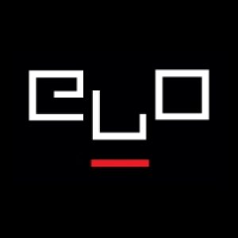

# Electronic Literature Dataset

## Repository structure

- `/data/e_lit_dataset.csv` – curated dataset  
- `/data/data_dictionary.md` – column definitions and allowed values  
- `/case-study/` – materials for the case study (Part B)

## Overview 

This dataset collects a curated selection of electronic literature works published between 1996 and 2011, focusing on web-based, multimedia, and hypertextual forms of digital writing, as part of the Final Assignment for the course. The goal of the dataset is to describe electronic literature as a digital literary object, taking into account textual form, interaction, technology, and preservation. Metadata for most items was primarily gathered [from the Electronic Literature Collection](https://eliterature.org/$0) (ELO), which served as the main research source due to its authoritative and standardized documentation.

## Selection criteria

The dataset includes 15 born-digital works of electronic literature.  
Each item was selected according to the following criteria:

- **Web‑based or born‑digital:** Only works originally created for the web or digital platforms (HTML, Flash, Shockwave, QuickTime, Prezi, etc.) were considered.

- **Accessible online:** Priority was given to works still accessible through the Electronic Literature Collection (ELC) or preserved via Conifer/Ruffle.

- **Sufficient metadata:** availability of information to describe its form, technology, and preservation.

- **English-language metadata:** Even when the works themselves are multilingual, all metadata is standardized in English.

- **Representative of major genres in electronic literature:** hypertext fiction, kinetic poetry, multimedia narratives, combinatorial works, interactive fiction, audiovisual pieces.

- **Documented publication history:** Works with clear publication dates, creators, and original publishers.

Almost all of the items were selected from the Electronic Literature Collection (Volumes 1–3), as it provides authoritative descriptions and standardized metadata.

## Data model

The dataset is designed to combine literary analysis with technical and preservation-oriented metadata.

The columns describe:
- **Core identification and access information:** Title, creator, year, URL.
- **Textual form and reader interaction:** type, genre, interaction level, textuality.
- **Technological infrastructure:** software dependencies, programming languages, authoring platforms.
- **Metadata provenance and preservation status.**
- **A short descriptive summary of each work**.

Additional fields such as genre, software dependencies, and authoring platforms were included to better capture aspects that are central to electronic literature but often invisible in print-based literary models.

## Dataset Limitations

Despite careful curation, the dataset has several inherent limitations:

- **Incomplete technical metadata**: many early digital works do not explicitly state programming languages or authoring tools. When information is unavailable, entries are marked “Not stated”.

- **Dependence on legacy technologies:** numeros works rely on deprecated platforms (Flash, Shockwave, QuickTime), which affects accessibility and long‑term preservation.

- **Variable accessibility:** some works are partially broken, inaccessible, or only viewable through emulation environments such as Ruffle or Conifer.

- **Language bias:** although multilingual works are included, the dataset is standardized in English, which may obscure linguistic nuances.

- **Temporal scope:** the dataset focuses primarily on works from 1996–2011, reflecting the period covered by the Electronic Literature Collection Volumes 1–3.

- **Web dependency:** because these works are web‑native, their survival depends on hosting, browser compatibility, and preservation efforts.

- **Privileging canonical works:** metadata is primarily derived from the Electronic Literature Collection.

These limitations reflect broader challenges in digital preservation and electronic literature studies.

# Case Study
